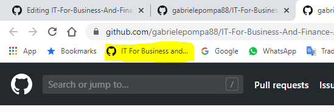
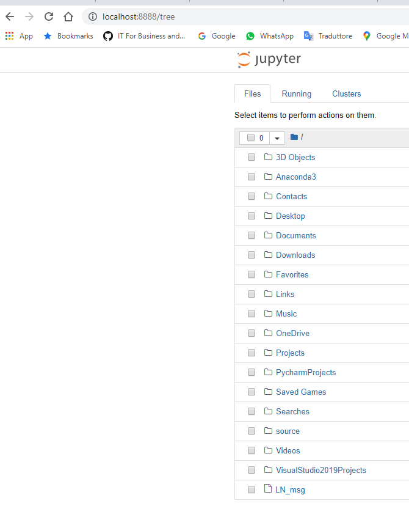
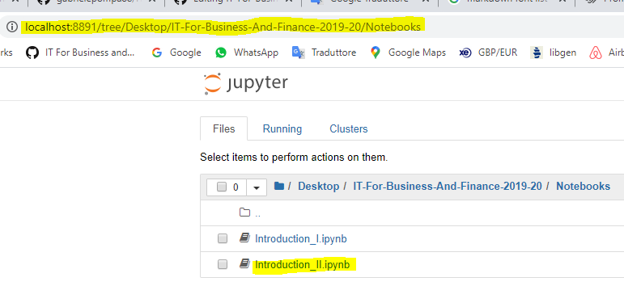
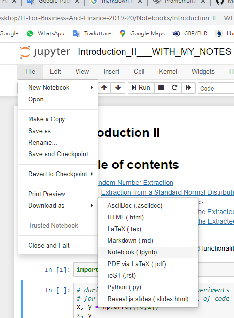

# How To Work This Class 

In this file you will find practical informations on how to work this class. Daily activities and once-for-all setup(s) are separately described both for in-class lessons and study from-home.

# Table of contents
- [How to work IN CLASS](#class)
  - [Before the lessons starts](#before_class)
  - [How to follow the lesson](#during_class)
- [How to work AT HOME](#home)
  - [First-time SETUP](#home_setup)
  - [How to work at home](#wfh)

## How to work IN CLASS 

### Before the lessons starts 
These are the X steps you need to be done **before** the lesson starts to effectively follow any in-class lesson:

0. In Google Chrome, go to the class webpage at [github.com/gabrielepompa88/IT-For-Business-And-Finance-2019-20](https://github.com/gabrielepompa88/IT-For-Business-And-Finance-2019-20). 

  - *TIP*: If not done already, add the class webpage to the list of favorites (see figure [1](#add_bookmark))
    
  |  | 
  |:--:| 
  | _**Figure 1**: add class webpage to Google Chrome's list favorites_ |
  
1. Open Anaconda Navigator and select the class conda `ITForBusAndFin2020_env` environment from the menu (see figure [2](#anaconda_nav_and_env)).

  |  | 
  |:--:| 
  | _**Figure 2**: open Anaconda Navigator and select the class conda environment_ |

3. Launch the Jupyer Notebook App (see figure [3](#launch_jupyer_nb)). A new panel in Chrome opens, listing the directories in your machine (see figure [4](#dir_structure_machine))

  |  | 
  |:--:| 
  | _**Figure 3**: launch the Jupyter Notebook app_ |

  |  | 
  |:--:| 
  | _**Figure 4**: Jupyter Notebook App entry page with list of directories_ |

4. Navigate to folder `/IT-For-Business-And-Finance-2019-20/Notebooks` (left-click on the blue links to step into the folders) and open the Notebook of the lesson (I will tell you which) clicking on the blue link to the `.ipynb` file (see figure [5](#how_to_open_nb)). 

  |  | 
  |:--:| 
  | _**Figure 5**: how to open a Notebook to follow the in-class lesson_ |

Now you are all setup and can start following the lesson on the open Notebook, taking notes on the Notebook etc...

### How to follow the lesson 
Let's suppose that you take notes on a Notebook - say _Introduction_II_ - and, let's say you add extra code-cells to the it, or make changes or so (see figure [6](#how_to_take_notes)).

  |  | 
  |:--:| 
  | _**Figure 6**: notes taken on a Jupyter Notebook. A new code-cell added_ |

When the lesson ends and you want to keep studying on the modified notebook at home. Then you can: 

- Rename your Notebook: simply clicking on the Notebook's name  _Introduction_II_ and give it a new name,  for example _Introduction_II___WITH_MY_NOTES_ (see figure [7](#rename_nb)).

  |  | 
  |:--:| 
  | _**Figure 7**: rename the Notebook where you have taken notes to make it clear it's not the original one_ |

- Download the Notebook (see figure [8](#download_as_nb)) _as a Notebook (.ipynb)_.

  |  | 
  |:--:| 
  | _**Figure 8**: download your notebook with your in-class notes and e-mail it to yourself_ |
  
- E-mail the Notebook `Introduction_II___WITH_MY_NOTES.ipynb` to yourself. **WARNING**: remember to log-off from gmail before you leave the IT class.
  
- Once at home, put the e-mailed Notebook `Introduction_II___WITH_MY_NOTES.ipynb` into the `/IT-For-Business-And-Finance-2019-20/My_Class_Notes` folder of your computer (see figure [9](#nb_with_notes_saved)).

  - *TIP*: if you don't have `/My_Class_Notes` folder into the `/IT-For-Business-And-Finance-2019-20` folder on your computer, you have to create it: follow the guide [First-time SETUP (things to do once and for all)](#home_setup).

  |  | 
  |:--:| 
  | _**Figure 9**: save the notebook with notes in the `/My_Class_Notes` of your computer_ |

- Open the Notebook `Introduction_II___WITH_MY_NOTES.ipynb` with your notes using the Jupyter Notebook App in the Anaconda Navigator installed in your computer

- *TIP*: if you don't have Anaconda Navigator, you have to install it: follow the guide [First-time SETUP (things to do once and for all)](#home_setup).

## How to work AT HOME 

### First-time SETUP (things to do once and for all) 

### How to work at home (things to everytime) 

