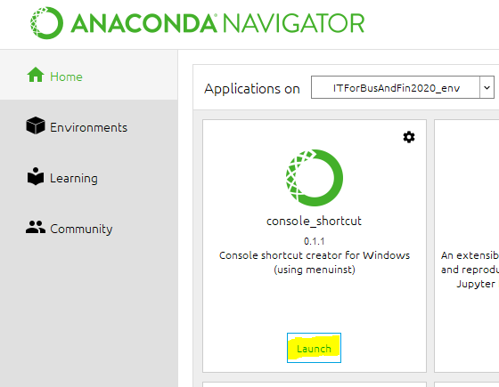
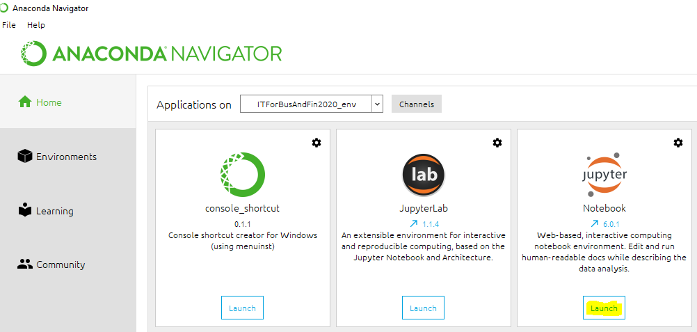
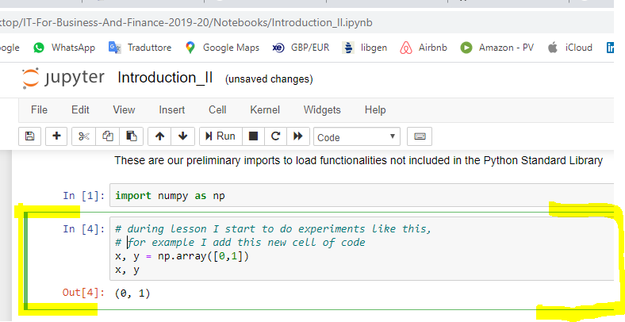
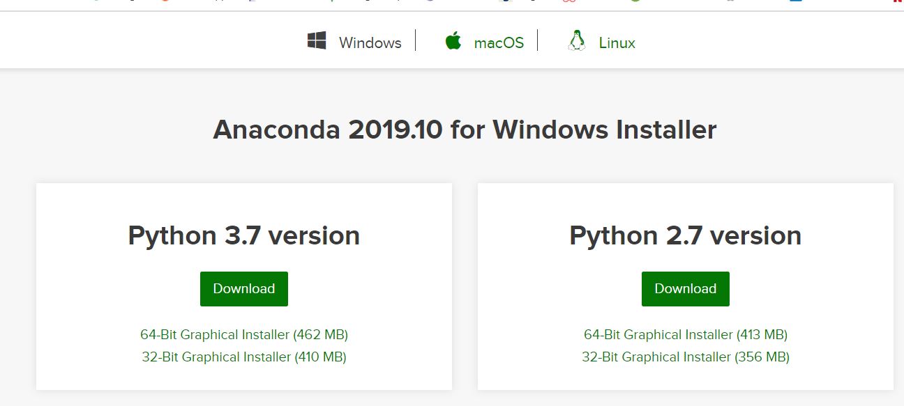
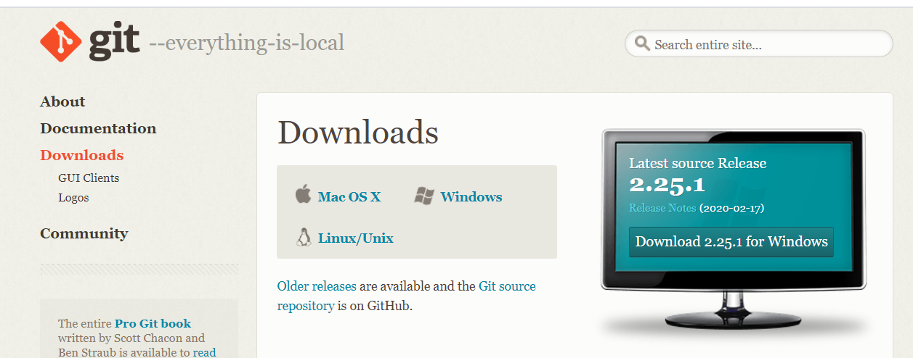
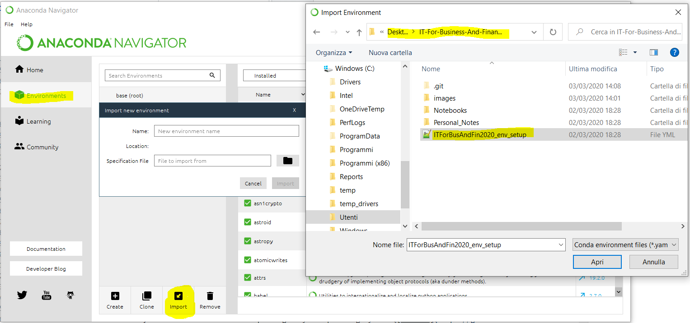

# How To Work This Class 

In this file you will find practical informations on how to work this class. Daily activities and once-for-all setup(s) are separately described both for in-class lessons and study from-home.

# Table of contents
- [How to work IN CLASS](#class)
  - [Before the lessons starts](#before_class)
  - [How to follow the lesson](#during_class)
- [How to work AT HOME](#home)
  - [First-time SETUP](#home_setup)
  - [How to work at home](#wfh)

# How to work IN CLASS <a name="class"></a>

## Before the lessons starts <a name="before_class"></a>
These are the steps you need to be done **before** the lesson starts to effectively follow any in-class lesson:

0. In Google Chrome, go to the class webpage at [github.com/gabrielepompa88/IT-For-Business-And-Finance-2019-20](https://github.com/gabrielepompa88/IT-For-Business-And-Finance-2019-20). 

  - *TIP*: If not done already, add the class webpage to the list of favorites (see figure [1](#add_bookmark))
    
  |  <a name="add_bookmark"></a>| 
  |:--:| 
  | _**Figure 1**: add class webpage to Google Chrome's list favorites_ |
  
1. Open Anaconda Navigator and select the class conda environment `ITForBusAndFin2020_env` from the menu (see figure [2](#anaconda_nav_and_env)).

  |  <a name="anaconda_nav_and_env"></a>| 
  |:--:| 
  | _**Figure 2**: open Anaconda Navigator and select the class conda environment_ |
  
2. Sync your local copy of the class repository to have the latest updated material of the class. To do this, do the following:

  - In the Anaconda Navigator, open the _console_shortcut_ app. A terminal window opens (see figure [6](#console_shortcut))

  |  <a name="console_shortcut"></a>| 
  |:--:| 
  | _**Figure 3**: Open a Terminal window using the console_shorcut app in Anaconda Navigator_ |

  - Navigate to folder `/Desktop/IT-For-Business-And-Finance-2019-20`, typing:
  
  ```
  cd C:\Users\it-bf\Desktop\IT-For-Business-And-Finance-2019-20
  ```
  
  - Do the syncing typing the following two commands (for an explanation of this commands see [this answer](https://stackoverflow.com/a/8888015/2533366) in [Stack Overflow](https://stackoverflow.com/), see also figure [4](#git_fetch_reset)):
  
  ```
  git fetch --all
  git reset --hard origin/master
  ```
  
  |  <a name="git_fetch_reset"></a>| 
  |:--:| 
  | _**Figure 4**: Syncing local copy of class repository with latest version_ |
  
  
  **WARNING**: `git reset` command will overwrite all changes to files in the class repository that are not in the dedicated `IT-For-Business-And-Finance-2019-20/Personal_Notes` folder. That is, for example, if these changes were notes that you took while on a Jupyter Notebook while reading it, these notes will be lost!!! See section [How to follow the lesson](#during_class) to effectively take notes during the lesson and section [How to work at home](#wfh) to know how to retrieve those notes at home and how to take new ones at home while studying on Notebooks. 

3. Launch the Jupyer Notebook App (see figure [5](#launch_jupyer_nb)). A new panel in Chrome opens, which lists the tree of all the directories in your machine (see figure [6](#dir_structure_machine))

  |  <a name="launch_jupyer_nb"></a>| 
  |:--:| 
  | _**Figure 5**: launch the Jupyter Notebook app_ |

  |  <a name="dir_structure_machine"></a>| 
  |:--:| 
  | _**Figure 6**: Jupyter Notebook App entry page with list of directories_ |

4. In the newly opened Google Chrome's panel, navigate to folder `/Desktop/IT-For-Business-And-Finance-2019-20/Notebooks` (left-click on the blue links to step into a folder) and open the Notebook that you want clicking on the blue link to the `.ipynb` file (see figure [7](#how_to_open_nb)). 

  |  <a name="how_to_open_nb"></a>| 
  |:--:| 
  | _**Figure 7**: how to open a Notebook to follow the in-class lesson_ |
  
## How to follow the lesson <a name="during_class"></a>
Let's suppose that you want to take notes on a Notebook - say `Introduction_II.ipynb` - and, let's say you add extra code-cells to it, or make changes to text cells or so (see figure [8](#how_to_take_notes)).

  |  <a name="how_to_take_notes"></a>| 
  |:--:| 
  | _**Figure 8**: notes taken on a Jupyter Notebook. A new code-cell added_ |

When the lesson ends you want to keep studying on the modified notebook at home. Then you can: 

0. Rename your Notebook: simply clicking on the Notebook's name  _Introduction_II_ and give it a new name,  for example _Introduction_II___WITH_MY_NOTES_ (see figure [9](#rename_nb)).

  |  <a name="rename_nb"></a>| 
  |:--:| 
  | _**Figure 9**: rename the Notebook where you have taken notes to make it clear it's not the original one_ |

1. Download the Notebook (see figure [10](#download_as_nb)) _as a Notebook (.ipynb)_.

  |  <a name="download_as_nb"></a>| 
  |:--:| 
  | _**Figure 10**: download your notebook with your in-class notes and e-mail it to yourself_ |
  
2. E-mail the renamed Notebook `Introduction_II___WITH_MY_NOTES.ipynb` to yourself. 

**WARNING**: remember to log-off from gmail before you leave the IT class.
  
# How to work AT HOME <a name="home"></a>

## First-time SETUP (things to do once and for all) <a name="home_setup"></a>
These are preliminary tasks to be done the first time that you work on this class from your personal computer.

0. Download Anaconda (see figure [11](#anaconda_download)):

  - go to [https://www.anaconda.com/distribution/#download-section](https://www.anaconda.com/distribution/#download-section)
  - on the top of the page, select the icon corresponding to your operating system (Windows, Max OS or Linux)
  - click the green button **Download** under the _Python 3.7 version_ section
  - follow installation instructions (keep default configurations unless you have a sound reason)

  |  <a name="anaconda_download"></a>| 
  |:--:| 
  | _**Figure 11**: download Anaconda_ |
  
1. Download Git (see figure [12](#git_download)):

  - go to [https://git-scm.com/downloads](https://git-scm.com/downloads)
  - in the **Download** section, click on the banner corresponding to your operating system ([Windows](https://git-scm.com/download/win), [Max OS](https://git-scm.com/download/mac) or [Linux/Unix](https://git-scm.com/download/linux))
  - follow installation instructions (keep default configurations unless you have a sound reason)

  |  <a name="git_download"></a>| 
  |:--:| 
  | _**Figure 12**: download Git_ |

2. clone the [IT-For-Business-And-Finance-2019-20](https://github.com/gabrielepompa88/IT-For-Business-And-Finance-2019-20) class repository into your `/Desktop` folder (see figure [13](#git_clone)):

  - move to your Desktop folder. Type:
  ```
  cd C:\Users\[$YOUR_USER_NAME]\Desktop
  ```
  
  where `[$YOUR_USER_NAME]` has to be substituted with your appropriate user name in your computer. 
  
  - Make the clone. Type:
  
  ```
  git clone https://github.com/gabrielepompa88/IT-For-Business-And-Finance-2019-20.git
  ```

  |  <a name="git_clone"></a>| 
  |:--:| 
  | _**Figure 13**: `git clone` the class repository into your `/Desktop` folder_ |

  You will see that a newly created `/IT-For-Business-And-Finance-2019-20` is created in your `/Desktop` folder.

3. In the newly created class local folder `/Desktop/IT-For-Business-And-Finance-2019-20` there is an environment setup file `ITForBusAndFin2020_env_setup.yml` from which the dedicated _ITForBusAndFin2020_env_ Conda environment can be created. This new conda environment contains all the packages needed for the course. Follow these steps to create and activate it (see figure [14](#import_env)):

  - In the Anaconda Navigator, click on _Environments_
  - at the bottom, click on _Import_
  - next to _Specification File_ browse for file `ITForBusAndFin2020_env_setup.yml` in your newly created `/Desktop/IT-For-Business-And-Finance-2019-20` folder
  - click open: a new environment _ITForBusAndFin2020_env_ gets created.
  - switch to the newly created _ITForBusAndFin2020_env_ environment.
  
  - *TIP*: under _Environment_ section, on the right, there is the list of packages installed under the newly created _ITForBusAndFin2020_env_ environment. Among many, you should find the following packages and version installed:
  
  ```
  Python 3.7.4
  Numpy 1.16.5
  Scipy 1.3.1
  Pandas 0.25.1
  Matplotlib 3.1.1
  ```

  |  <a name="import_env"></a>| 
  |:--:| 
  | _**Figure 14**: importing class conda environment  _ITForBusAndFin2020_env_ Conda environment_ |

## How to work at home (things to do everytime) <a name="wfh"></a>
When you are at home and want to study for this class, you can do the following:

0. Follow all the steps (0., 1., 2., 3. and 4.) explained in section [Before the lessons starts](#before_class) on your computer. 

- *TIP*: make appropriate changes to folder paths when needed. In particular, to navigate to folder `/Desktop/IT-For-Business-And-Finance-2019-20`, the command to be typed will be something like:
  
  ```
  cd C:\Users\[$YOUR_USER_NAME]\Desktop\IT-For-Business-And-Finance-2019-20
  ```
where `[$YOUR_USER_NAME]` has to be substituted with your appropriate user name in your computer. 

1. Go to your email application and put the e-mailed Notebook(s) (in the example from section [How to follow the lesson](#during_class), we emailed to ourselves the renamed `Introduction_II___WITH_MY_NOTES.ipynb` Notebook with notes taken during a lesson) into the `/IT-For-Business-And-Finance-2019-20/Personal_Notes` folder of your computer (see figure [11](#nb_with_notes_saved)).

  |  <a name="nb_with_notes_saved"></a>| 
  |:--:| 
  | _**Figure 11**: save the notebook with notes in the `/IT-For-Business-And-Finance-2019-20/Personal_Notes` of your computer_ |

2. Work on the Notebook `Introduction_II___WITH_MY_NOTES.ipynb` or any other Notebook or file in `/IT-For-Business-And-Finance-2019-20` folder using the Jupyter Notebook App or the Spyder App of the Anaconda Navigator, but

- **WARNING**: any file that you modify in the folder `/IT-For-Business-And-Finance-2019-20` that is not in `/IT-For-Business-And-Finance-2019-20/Personal_Notes` sub-folder will be over-written by the `git-reset` command. Therefore, if you want to study on a Notebook/file and make changes/notes/experiments to it, just **copy-n-paste the file into /Personal_Notes folder**. Also, if you want to create new files (Notebooks, script, data, whatever) and want to be sure it won't be touched.. then **create any new personal file into /Personal_Notes folder**.

